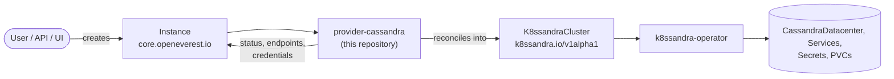

# Apache Cassandra Provider

> [!WARNING]
> **Pre-alpha.** OpenEverest v2 and this provider are under active development. CRD schemas,
> chart values and defaults change frequently, including in breaking ways, and there is no
> supported upgrade path between versions yet. Not for production use.

<!-- Remove the pre-alpha banner and the status badge at v2 GA. -->

[](https://github.com/openeverest/openeverest)
[](https://github.com/openeverest/provider-cassandra/actions/workflows/ci.yaml)
[](https://github.com/openeverest/provider-cassandra/releases)
[](https://pkg.go.dev/github.com/openeverest/provider-cassandra)
[](LICENSE)

Run **Apache Cassandra** on Kubernetes through
[OpenEverest](https://github.com/openeverest/openeverest), backed by the
[k8ssandra-operator](https://github.com/k8ssandra/k8ssandra-operator).

## What this is

OpenEverest providers translate a single, technology-agnostic `Instance` custom resource into
the native custom resources of an upstream Kubernetes operator — for databases, but equally
for caches, message queues, object storage, or model-serving runtimes. This repository is the
provider for **Apache Cassandra**: it owns the technology-specific knowledge — topologies,
versions, parameters, backup wiring — so that users, the API server, and the UI stay
technology-agnostic.

> [!IMPORTANT]
> **This provider is not standalone.** It requires an OpenEverest installation (core CRDs and
> controller) in the cluster. Installing this chart on its own does nothing.
> See [Install OpenEverest](https://openeverest.io/documentation/current/quick-install.html).



The provider watches `Instance` resources whose `spec.providerRef.name` is `provider-cassandra`,
and reports workload health back onto `Instance.status`. It never manages pods directly — all
lifecycle work is delegated to the operator.

## Compatibility

| provider-cassandra | OpenEverest | k8ssandra-operator | Kubernetes |
|---|---|---|---|
| `0.1.x` | `2.0.0-dev.1` | `1.32.x` | `1.30` – `1.34` |

## Capabilities

What you can do to a running instance through the `Instance` API. Upgrading the
provider itself is covered under [Installation](#installation).

| Capability | Status | Notes |
|---|---|---|
| Provisioning | ✅ | |
| Horizontal scaling | ✅ | `spec.components.engine.replicas` |
| Vertical scaling (CPU / memory) | ✅ | `spec.components.engine.resources` |
| Version upgrades | ✅ | of the deployed Cassandra version — change `spec.version`; see [Versions](#versions) |
| Monitoring | 🚧 | optional `monitoring` component (Prometheus) — wiring in progress |

Stateful workloads additionally report:

| Capability | Status | Notes |
|---|---|---|
| Persistent storage | ✅ | `spec.components.engine.storage` |
| Storage expansion | ✅ | when the StorageClass allows volume expansion |
| Backups (on demand) | ✅ | operator-native (`executionMode: ProviderManaged`) via Medusa |
| Restore | ✅ | in place, via Medusa restore jobs |
| Scheduled backups / PITR | 🚧 | not yet supported |

## Installation

The provider chart is published to the repository's Helm chart repository:

```bash
helm repo add provider-cassandra https://openeverest.github.io/provider-cassandra/
helm repo update
helm install provider-cassandra provider-cassandra/provider-cassandra \
  --version 0.1.0 \
  --namespace everest-system
```

- The k8ssandra-operator (with cass-operator and Medusa CRDs) is bundled as a chart dependency
  and is installed automatically. Set `operator.enabled=false` to use an externally managed
  operator instead.
- The operator is installed **cluster-scoped** (`global.clusterScoped=true`) so it reconciles
  `Instance`-backed clusters in any namespace.

> [!IMPORTANT]
> The operator's admission webhooks require [cert-manager](https://cert-manager.io) to be
> installed in the cluster before installing this chart.

Upgrade and uninstall:

```bash
helm repo update
helm upgrade provider-cassandra provider-cassandra/provider-cassandra --version 0.1.0
helm uninstall provider-cassandra --namespace everest-system
```

Uninstalling the chart does **not** delete running `Instance` resources or their data.

## Usage

Verify that the provider registered itself:

```bash
kubectl get providers.core.openeverest.io provider-cassandra
```

Create an instance:

```yaml
apiVersion: core.openeverest.io/v1alpha1
kind: Instance
metadata:
  name: my-instance
spec:
  providerRef:
    name: provider-cassandra
  version: "5.0"
  topology:
    type: singleDatacenter
  components:
    engine:
      type: cassandra
      replicas: 3
      resources:
        requests:
          cpu: "1"
          memory: 4Gi
      storage:
        size: 25Gi
```

Component names are defined by this provider — see [definition/provider.yaml](definition/provider.yaml).
`spec.version` and `spec.topology` are optional; the provider defaults apply.
More examples live in [examples/](examples/).

Watch it come up and read the connection details:

```bash
kubectl get instance my-instance -w
kubectl get instance my-instance -o jsonpath='{.status.connection}'
```

Credentials are in the secret named by `.status.connection.credentialsSecretRef`.

## Topologies

<!-- BEGIN GENERATED: topologies -->
| Topology | Default | Description |
|---|---|---|
| `singleDatacenter` | ✅ | A single Cassandra datacenter (`dc1`) built from the `engine` component |
<!-- END GENERATED: topologies -->

The `backupAgent` (Medusa) and `monitoring` (Prometheus) components are optional.

## Versions

<!-- BEGIN GENERATED: versions -->
| Version bundle | Default | cassandra | medusa | prometheus |
|---|---|---|---|---|
| `5.0` | ✅ | `5.0.4` | `0.22.3` | `2.55.1` |
| `4.1` | | `4.1.9` | `0.22.3` | `2.55.1` |
<!-- END GENERATED: versions -->

Source of truth: [definition/versions.yaml](definition/versions.yaml).

The `cassandra` image is the k8ssandra management-api image; the operator must already support
the target version — upgrade the provider chart first.

## Configuration

- **Chart values:** [charts/provider-cassandra/values.yaml](charts/provider-cassandra/values.yaml)
- **Instance parameters:** per-component and per-topology `parameters` schemas, defined under
  [definition/](definition/) and published on the `Provider` resource
  (`kubectl get provider provider-cassandra -o yaml`). The API server and the UI validate user
  input against these schemas.

The technology-specific knobs worth knowing about:

| Parameter | Applies to | Purpose |
|---|---|---|
| `monitoringConfigName` | `monitoring` | Monitoring configuration to attach the instance to |

## Development

Requires Go (see [go.mod](go.mod)), Docker, Helm, kubectl, and a Kubernetes cluster you can
reach. [dev/README.md](dev/README.md) covers the environment end to end: the recommended
local k3d setup, running against a cluster you already have, and every `dev/.env` setting.

```bash
make dev-up             # local cluster + Tilt dev environment (see dev/README.md)
make generate           # RBAC, provider spec, Helm chart sync
make run                # run the provider locally against the cluster
make test-unit
make test-integration   # chainsaw suites under test/integration/
make dev-down
```

`make help` lists every target. `make verify` fails when generated files are stale — run
`make generate` and commit the result.

The provider contract (`Validate` / `Sync` / `Status` / `Cleanup`), RBAC markers, watches,
code generation, and the backup/restore interfaces are documented once for all providers in
[PROVIDER_DEVELOPMENT.md](https://github.com/openeverest/provider-sdk/blob/main/PROVIDER_DEVELOPMENT.md).

### Layout

| Path | Purpose |
|---|---|
| `cmd/provider/` | Entry point |
| `internal/provider/` | `ProviderInterface` implementation, backup interfaces, RBAC markers |
| `internal/common/` | Component name constants |
| `definition/` | Provider identity, component types, versions, topologies, backup classes |
| `charts/provider-cassandra/` | Helm chart (`generated/` is produced by `make generate`) |
| `config/rbac/role.yaml` | Generated `ClusterRole` — do not edit |
| `test/integration/` | Chainsaw suites: `core` |
| `examples/` | Example `Instance` resources |
| `dev/` | Tilt dev environment, `.env` configuration, k3d cluster config |
| `.github/workflows/` | CI: lint, build, unit and integration tests, release |

### Testing

- **Unit tests** — `make test-unit`.
- **Integration tests** — chainsaw suites under [test/integration/](test/integration/).
  Individual suites are also exposed as make targets (`make test-integration-core`, …).
- **CI** — [.github/workflows/ci.yaml](.github/workflows/ci.yaml) runs lint, build, unit
  tests, generated-file verification, Helm lint, and each integration suite on every pull
  request.

## Troubleshooting

```bash
kubectl logs -n everest-system deploy/provider-cassandra -f
```

| Symptom | Where to look |
|---|---|
| `Instance` stuck in `Creating` | `kubectl describe instance <name>` conditions, then the provider logs |
| No `Provider` resource in the cluster | Is the chart installed? Check the provider deployment logs |
| `Instance` ignored entirely | `spec.providerRef.name` must be `provider-cassandra` |
| `K8ssandraCluster` created but not reconciled | Confirm the operator is running and cluster-scoped, and that cert-manager is installed |
| `K8ssandraCluster` created but no pods | Inspect the `K8ssandraCluster` / `CassandraDatacenter` status — the failure is upstream in the operator |
| Readiness probe `500` right after start | Normal during Cassandra's first boot; wait for the `CassandraDatacenter` to reach `Ready` |